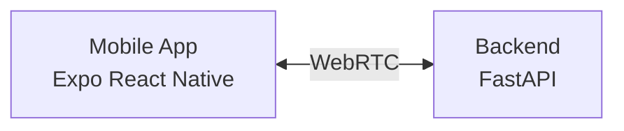
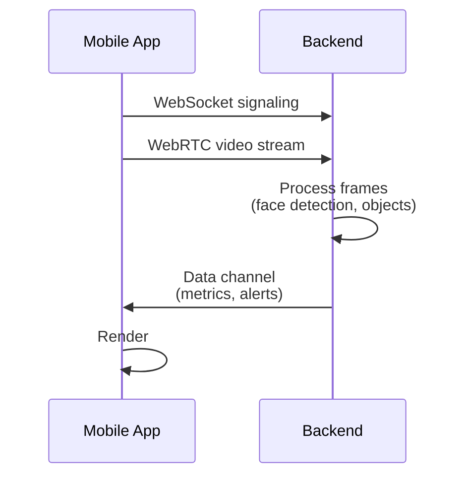

# Architecture

## System overview

Manobela is a driver monitoring system with two primary components:

- Backend: FastAPI service that handles WebRTC signaling and video processing.
- Mobile app: Expo React Native app that captures camera video and displays results.

Note: the Website is just Next.js marketing and download site.

## High-level flow

1. The mobile app opens a WebRTC connection to the backend.
2. The backend receives video frames and runs face landmarks and object detection.
3. The backend sends inference data and alerts back over a data channel.
4. The mobile app renders overlays and alerts in real time.

