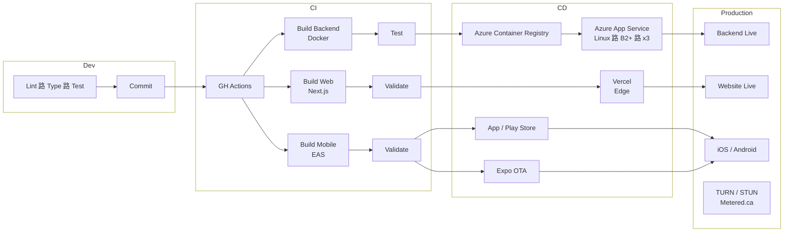

# Deployment

```mermaid
flowchart LR

classDef transparent fill:none

subgraph Dev["Dev"]
  QA[Lint 路 Type 路 Test]
  QA --> Commit[Commit]
end
class Dev transparent

subgraph CI["CI"]
  Commit --> Actions[GH Actions]

  Actions --> BBE[Build Backend<br/>Docker]
  Actions --> BMW[Build Mobile<br/>EAS]
  Actions --> BWW[Build Web<br/>Next.js]

  BBE --> TBE[Test]
  BMW --> VMW[Validate]
  BWW --> VWW[Validate]
end
class CI transparent

subgraph CD["CD"]
  TBE --> ACR[Azure Container Registry]
  ACR --> Azure[Azure App Service<br/>Linux 路 B2+ 路 x3]

  VWW --> Vercel[Vercel<br/>Edge]

  VMW --> Stores[App / Play Store]
  VMW --> OTA[Expo OTA]
end
class CD transparent

subgraph Prod["Production"]
  Azure --> API[Backend Live]
  Vercel --> Web[Website Live]
  Stores --> Mobile[iOS / Android]
  OTA --> Mobile
  TURN[TURN / STUN<br/>Metered.ca]
end
class Prod transparent
```
