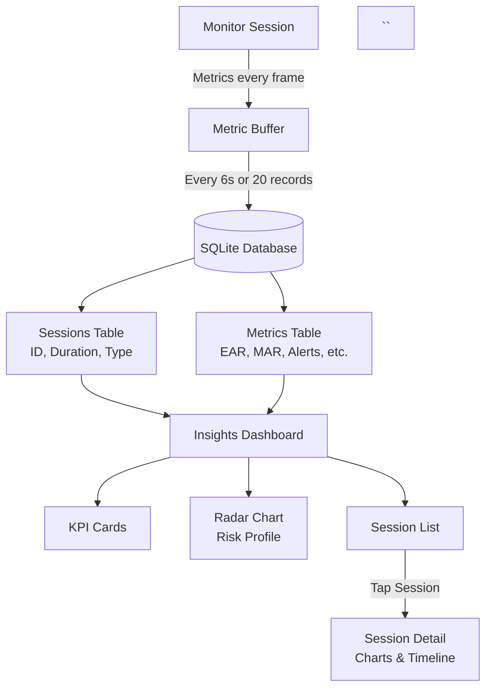
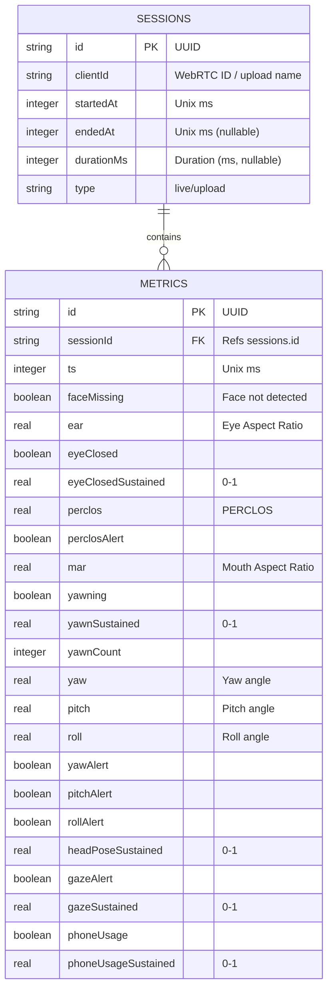

# Logging Insights

## Basic Flow

- Session monitoring generates metrics every frame.
- Metrics are buffered in memory.
- Buffer flushes to SQLite every 6s or 20 records.
- Data is stored in:
  - **Sessions** table (ID, duration, type)
  - **Metrics** table (EAR, MAR, alerts, etc.)

- Dashboard reads from both tables.
- Dashboard provides:
  - KPI cards
  - Radar risk chart
  - Session list

- Selecting a session shows detailed charts and timeline.

## Database Schema

