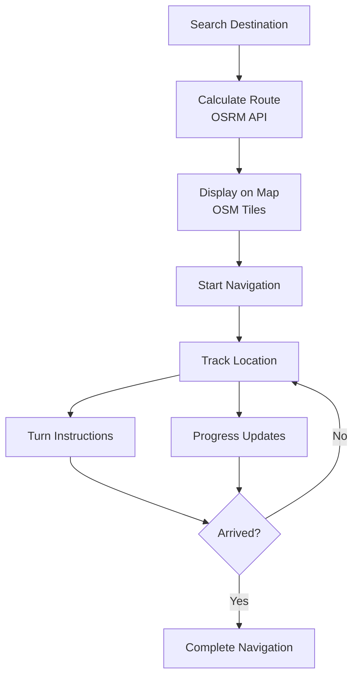

# Maps Integration

## Basic Flow

```mermaid
graph TD
    Search[Search Destination] --> Route[Calculate Route<br/>OSRM API]

    Route --> Display[Display on Map<br/>OSM Tiles]
    Display --> Nav[Start Navigation]

    Nav --> Track[Track Location]
    Track --> Turn[Turn Instructions]
    Track --> Progress[Progress Updates]

    Turn --> Arrival{Arrived?}
    Progress --> Arrival
    Arrival -->|Yes| Complete[Complete Navigation]
    Arrival -->|No| Track
```

## Auto-Coordination
