# Metrics

## Overview

Metrics are computed per frame and returned to the client. Each metric may include a boolean alert flag and additional fields.

## Metric keys

- face_missing
- eye_closure
- yawn
- head_pose
- gaze
- phone_usage

## Alerts

Any metric field that ends with `\_alert` and is true is treated as an alert.

## Basic flo

```mermaid
graph TB

%% Subgraph class definition
classDef transparentSubgraph fill:none

%% Input
subgraph Input["Input"]
  L[Landmarks<br/>478 pts]
  D[Detections<br/>BBoxes]
end
class Input transparentSubgraph

%% Eye Metrics
subgraph Eye["Eye Metrics"]
  EARL[EAR L]
  EARR[EAR R]
  EAR[Avg EAR]
  Hist[History<br/>10s]
  PERC[PERCLOS]
  Closed[Eye Closed<br/>debounced]
end
class Eye transparentSubgraph

%% Mouth Metrics
subgraph Mouth["Yawn"]
  MAR[MAR]
  MARs[EMA]
  Yawn[Yawning<br/>hysteresis]
  YCnt[Counter]
end
class Mouth transparentSubgraph

%% Head Pose Metrics
subgraph Head["Head Pose"]
  Yaw[Yaw]
  Pit[Pitch]
  Rol[Roll]
  Base[Baseline<br/>1s]
  Rel[Relative]
  HAlert[Alerts]
end
class Head transparentSubgraph

%% Gaze Metrics
subgraph Gaze["Gaze"]
  IrisL[Iris L]
  IrisR[Iris R]
  GS[EMA]
  GR[Range]
  GAlert[Alert<br/>EAR-aware]
end
class Gaze transparentSubgraph

%% Phone Usage Metrics
subgraph Phone["Phone Use"]
  PF[Class 67]
  CF[Conf ≥0.5]
  PD[Debounce]
  PState[State]
end
class Phone transparentSubgraph

%% Connections
%% Eye
L --> EARL --> EAR
L --> EARR --> EAR
EAR --> Hist --> PERC
EAR --> Closed

%% Mouth
L --> MAR --> MARs --> Yawn --> YCnt

%% Head
L --> Yaw --> Base
L --> Pit --> Base
L --> Rol --> Base
Base --> Rel --> HAlert

%% Gaze
L --> IrisL --> GS
L --> IrisR --> GS
GS --> GR --> GAlert
EAR -.->|suppress| GAlert

%% Phone
D --> PF --> CF --> PD --> PState
```

