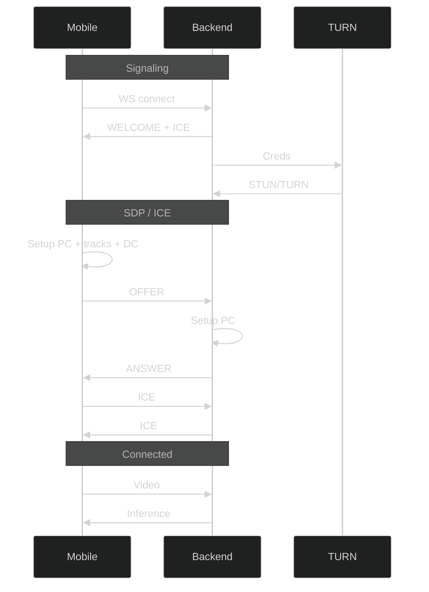

# WebRTC signaling

## Basic flow

1. Client opens a WebSocket connection to the backend.
2. Backend responds with `welcome` (client_id) and initial ICE server info.
3. Backend requests STUN/TURN credentials from TURN and receives config.
4. Client creates RTCPeerConnection, adds camera track and data channel.
5. Client sends SDP `offer` to backend.
6. Backend creates RTCPeerConnection and replies with SDP `answer`.
7. Client and backend exchange `ice-candidate` messages.
8. WebRTC connection is established:
   - Client streams encrypted video to backend.
   - Backend sends inference data over the data channel.

## Signaling message types

- welcome: sent by server on connect.
- offer: SDP offer from client.
- answer: SDP answer from server or client.
- ice-candidate: ICE candidate message.
- error: error response from server.

## Data channel messages

The server expects JSON messages over the data channel with the following types:

- monitoring-control
  - action: pause or resume
- head_pose_recalibrate
  - requests head pose baseline reset
